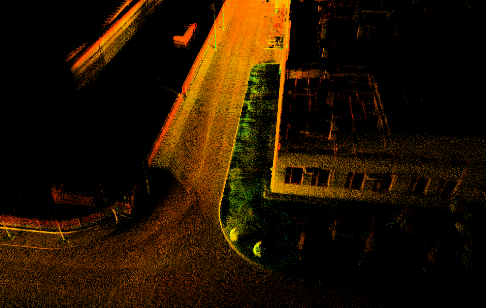

## UD-LIOM
**UD-LIOM** (Universal Tightly-Coupled Direct LiDAR-Inertial Odometry and Mapping Framework) is a universal LiDAR SLAM technology designed to be compatible with both mechanical and various solid-state LiDARs. It addresses the long-standing challenge of algorithm incompatibility caused by differences in LiDAR scanning patterns. By supporting diverse LiDAR types, UD-LIOM significantly expands the applicability of LiDAR SLAM, particularly for emerging solid-state LiDARs. Its key features include:
1. A novel, tightly-coupled direct LiDAR-inertial odometry and mapping framework for LiDARs with different scanning patterns.
2. An innovative point cloud classification and registration method, designed to work well with diverse scanning patterns, especially those of solid-state LiDARs with repetitive scanning.
3. A new multi-constraint optimization model that combines LiDAR observation residual errors with IMU pre-integration.

**UD-LIOM Performance with RSM1 LiDAR**
<div style="display: flex; gap: 10px; flex-wrap: wrap;">
  
  
</div>

**UD-LIOM Performance with Livox LiDAR**
<div style="display: flex; gap: 10px; flex-wrap: wrap;">
  
  
</div>

**UD-LIOM Performance in Challenging Unstructured Environments**
<div style="display: flex; gap: 10px; flex-wrap: wrap;">
  
  
</div>

## Framework
In UD-LIOM, raw point clouds and IMU data first undergo preprocessing, including IMU pre-integration and point cloud distortion correction (aided by IMU results), after temporal synchronization between LiDAR and IMU. Then, the system classifies undistorted point clouds into edge or planar points by range smoothness and matches them with relevant submaps. Matching residual errors combined with IMU-derived local pose transformations form a multi-constraint optimization model, which serves as the objective function for local pose estimation and sliding window optimization, outputting the final system pose and global map. Finally, submaps are updated using localization and mapping results for future matching.
<div style="display: flex; gap: 10px; flex-wrap: wrap;">
  
</div>

## 1. Prerequisites
- **Ubuntu** (tested on Ubuntu 18.04/20.04)
- **ROS** [Installation](http://wiki.ros.org/ROS/Installation)
- **PCL**(>=1.8) [Installation](http://www.pointclouds.org/downloads/linux.html).
- **Eigen**(>=3.3) [Installation](http://eigen.tuxfamily.org/index.php?title=Main_Page).
- **Ceres**(>=2.0) [Installation](http://ceres-solver.org/installation.html).
- **GTSAM**(>=4.0) [Installation](https://gtsam.org/get_started/).
- **livox_ros_driver**(for livox LiDAR point processing) [Installation](https://github.com/Livox-SDK/livox_ros_driver).

### Datasets:
We provide datasets recorded by RSM1, Livox, and Velodyne LiDAR in challenging environments.
You can download from [here](https://tongjieducn-my.sharepoint.com/:f:/g/personal/2510258_tongji_edu_cn/ElSZdmkd6FlNhyM86lx4qicBwEgqKaszugvDy__oy4f6uA?e=GDQyXr).

## 2. Compilation
Clone the repository and catkin_make:

```
    cd ~/UD-LIOM/src
    git clone https://github.com/BaoshengZhang0/UD-LIOM.git
    cd ..
    catkin_make
    source devel/setup.bash
```

## 3. Run
1. Run the launch for specific LiDAR type.
2. Play the .bag file or connect the LiDAR.

**Noted:**
If the IMU is required, ensure that the parameter `imu_enable: true` is set in the .config file and that the LiDAR point cloud with timestamp.

### 3.1 For RSM1 LiDAR
Download the dataset or connect to the RSM1 LiDAR (ensure that the point cloud topic matches the parameter in the `config/rsm1.config` file).
```
    cd ~/UD-LIOM
    source devel/setup.bash
    roslaunch ud_liom rsm1.launch
    rosbag play RSM1_1.bag
```

### 3.2 For Livox LiDAR
Download the dataset or connect to the Livox LiDAR.
```
    cd ~/UD-LIOM
    source devel/setup.bash
    roslaunch ud_liom livox.launch
    rosbag play LIVOX_1.bag
```

### 3.3 For Velodyne LiDAR
Download the dataset or connect to the Velodyne LiDAR.

```
    cd ~/UD-LIOM
    source devel/setup.bash
    roslaunch ud_liom velodyne.launch
    rosbag play VELO_1.bag
```

### 3.4 For Ouster LiDAR
Connect to the Ouster LiDAR.

```
    cd ~/UD-LIOM
    source devel/setup.bash
    roslaunch ud_liom ouster.launch
```

### 3.5 For RoboSense mechanical LiDAR
Connect to the RS mechanical LiDAR.

```
    cd ~/UD-LIOM
    source devel/setup.bash
    roslaunch ud_liom rsmech.launch
```

## 4.Acknowledgments

Thanks for [FSAT-LIO](https://github.com/hku-mars/FAST_LIO), [FSAT-LIO2](https://github.com/KMU-FMCL/FAST-LIO2) and [LiLi-OM](https://github.com/KIT-ISAS/lili-om).

## License
The source code is released under [GPLv3](http://www.gnu.org/licenses/) license.
